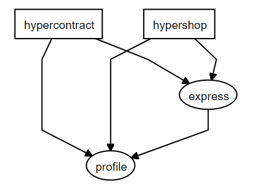

# hypercontract

*hypercontract* is a concept for describing RESTful Web APIs using [profiles](https://tools.ietf.org/html/rfc6906) written in [RDF](https://www.w3.org/TR/rdf-primer/).

This workspace contains the source code of a prototype implementation of this concept. It consists of two applications:

- [*hypercontract*](https://hypercontract.org) - a web server that publishes the hypercontract RDF vocabulary
- [*hypershop*](https://example.hypercontract.org) - a demo application with an REST API documented with hypercontract

## Requirements

* [Node.js](https://nodejs.org/en/) 12 or higher
* [npm](https://www.npmjs.com/get-npm) 6 or higher

## Quick Start

### Setup
```sh
git clone https://github.com/hypercontract/hypercontract.git
cd hypercontract
npm install
```

### Start

Run `npm start` and browse to...

- http://localhost to open *hypershop*
- http://localhost/profile to open the *hypershop* API documentation
- http://localhost:8080 to open the *hypercontract* vocabulary documentation

### Test

- `npm test` - Run E2E tests
- `npm start`, then `npm run test-postman` - run [Postman](https://www.getpostman.com/) tests

Alternatively, you can import Postman collections from `/postman` into your Postman application. 

## Architecture Overview

The project is written in TypeScript and set up as an [Nx Workspace](https://nx.dev/) consisting of two applications and two libraries.



**hypercontract**

`hypercontract` is a web application built with [NestJS](https://nestjs.com/), using [Express](https://expressjs.com/) under the hood. Its only purpose is to publish the *hypercontract* RDF vocabulary at https://hypercontract.org.

**hypershop**

`hypershop` is a web application, also built with [NestJS](https://nestjs.com/) and [Express](https://expressjs.com/). It serves as a demo to showcase how to describe a RESTful Web API using *hypercontract*. For this, it serves a simple online shop offering a catalog of randomly generated products that can be added to a shopping cart to place a new order.

The functionality of *hypershop*  can be accessed through the browser as HTML representations or using an HTTP client as JSON, JSON-HAL or JSON-LD

## Walkthrough

> All examples in this walkthrough can also be executed locally. Just replace the URLs accordingly:
> - http://localhost:8080 for https://hypercontract.org
> - http://localhost for https://example.hypercontract.org

### Content Negotiation by Media Type

The *hypershop* REST API supports JSON, [JSON-HAL](http://stateless.co/hal_specification.html) and [JSON-LD](https://json-ld.org/) as well as HTML. All requests in against the API can be executed in either of these formats.

- JSON (`application/json`)
- JSON-HAL (`application/hal+json`)
- JSON-LD (`application/ld+json`)
- HTML (`text/html`)

Request the [API Root](https://example.hypercontract.org/profile/ApiRoot) as *JSON-HAL*.
```
GET https://example.hypercontract.org
Accept: application/hal+json
```

Requests with other media types fail with a `406 Not Acceptable` response.

```
GET https://example.hypercontract.org
Accept: application/xml
```

### Content Negotiation by Profile

The *hypershop* REST API also supports [Content Negotiation by Profile](https://profilenegotiation.github.io/I-D-Profile-Negotiation/I-D-Profile-Negotiation).

Request the [API Root](https://example.hypercontract.org/profile/ApiRoot) according to the hypershop profile (`https://example.hypercontract.org/profile`).

```
GET https://example.hypercontract.org
Accept: application/ld+json
Accept-Profile: <https://example.hypercontract.org/profile>
```

Requesting a profile not supported by the application fails with a `406 Not Acceptable` response.

```
GET https://example.hypercontract.org
Accept: application/ld+json
Accept-Profile: <https://example.org>
```

### Exploring the API

#### Discover the Entry Point

Open the [*hypershop* profile](https://example.hypercontract.org/profile) in your browser.

Note that...
- the **Entry Point** of the API is defined as `https://example.hypercontract.org`
- the Entry Point URL returns an [ApiRoot](https://example.hypercontract.org/profile/ApiRoot) resource
- the **Default Namespace** of the API is defined as `https://example.hypercontract.org/profile/`
>
This means that...
1. the only URL we need to know is the entry point URL
2. we can look up the `ApiRoot` definition to find out what we'll get when accessing the entry point
3. all descriptors can be dereferenced via their URIs by prefixing them with the default namespace.

You can also request a machine-readable version in various RDF formats:

- JSON-LD (`application/ld+json`)
- RDF/XML (`application/rdf+xml`)
- Turtle (`text/turtle`)
- N-Triples (`application/n-triples`)
- N-Quads (`application/n-quads`)
- TriG (`application/trig`)

```
GET https://example.hypercontract.org/profile
Accept: application/hal+json
```

#### Learn about `ApiRoot`

Open the [`ApiRoot` definition](https://example.hypercontract.org/profile/ApiRoot) in your browser.

From the `ApiRoot` resource there are four possible state transitions identified by these link relation types:

- to the Order History via [`orderHistory`](https://example.hypercontract.org/profile/orderHistory)
- to the Shopping Cart via [`shoppingCart`](https://example.hypercontract.org/profile/shoppingCart)
- to the User Profile via [`userProfile`](https://example.hypercontract.org/profile/userProfile)
- via the [`searchCatalog`](https://example.hypercontract.org/profile/searchCatalog) operation

You can also request a machine-readable version of all profile concepts.

```
GET https://example.hypercontract.org/profile/ApiRoot
Accept: application/hal+json
```

#### Learn about the `searchCatalog` Operation

You can learn more a about any profile concept by prefixing the name with the default namepspace.

Open the [`searchCatalog` definition](https://example.hypercontract.org/profile/searchCatalog) in your browser.

The definition of the `searchCatalog` operation tells us that the state transition...

* is performed by a **GET** request against the link target
* the link target is a [`SearchResults` resource](https://example.hypercontract.org/profile/SearchResults)
* the request requires query parameters described by the [`SearchQuery` class](https://example.hypercontract.org/profile/SearchQuery)

#### Learn how to serialize `SearchQuery` as Query parameter

Open the [`SearchQuery` definition](https://example.hypercontract.org/profile/SearchQuery) in your browser.

The `SearchQuery` definition only refers to a `queryString` property of type `string` which is a...

> A free-text search term that is used to search the catalog for Products. It is matched against the product name and the product description.

As the `SearchQuery` class describes the query parameters of the `searchCatalog` operation, we need to know how to serialize this type as a query parameter. The profile specifies this using `application/td+xml` schema describing a URI template of type `text/uri-list`:

```
https://example.hypercontract.org/products{?queryString}
```

#### Learn how `SearchResults` are returned

Open the [`SearchResults` definition](https://example.hypercontract.org/profile/SearchResults) in your browser.

The definition tells us that the representation returned when performing the `searchCatalog` operation will contain the total number of results in a `totalResults` descriptor as well as a list of [`Product` representations](https://example.hypercontract.org/profile/Product) identified by the [`products` descriptor](https://example.hypercontract.org/profile/products).

It also describes how the `SearchResults` resource is serialized using JSON Schemas for

- `application/hal+json`
- `application/json`
- `application/ld+json`

#### Performing the `searchCatalog` Operation

Search the catalog by requesting search results as JSON-LD.

```
GET https://example.hypercontract.org/products/?queryString=pizza
Accept: application/ld+json
```

The response contains a list of `Product`s, each uniquely identified through the JSON-LD-specific `@id` property. Every product also has a `addToShoppingCart` descriptor.

#### Learn about the `addToShoppingCart` Descriptor

Open the [`addToShoppingCart` definition](https://example.hypercontract.org/profile/addToShoppingCart) in your browser.

`addToShoppingCart` is an Operation like `searchCatalog`. However, this time the state transition

* requires a **POST** request
* expects a request body matching the [`AdditionToShoppingCart` concept](https://example.hypercontract.org/profile/AdditionToShoppingCart)
* returns a representation of the [`ShoppingCart` resource](https://example.hypercontract.org/profile/ShoppingCart)
* (even though the target of the state transition is the `ShoppingCartItems` resource)

#### Add a Product to the Shopping Cart

Open the [`AdditionToShoppingCart` definition](https://example.hypercontract.org/profile/AdditionToShoppingCart) to learn how to build the request body for the `addToShoppingCart` operation.

Open the [`ShoppingCart` definition](https://example.hypercontract.org/profile/ShoppingCart) to learn what response to expect when performing the operation.

Use everything you learned to add a product to the shopping cart.

```
POST https://example.hypercontract.org/shoppingCart/items
Accept: application/ld+json
Content-Type: application/json

{
    "product": "https://example.hypercontract.org/products/3c6118c5-ef72-4cfa-a767-933127c6e679",
    "quantity": 2
}
```
